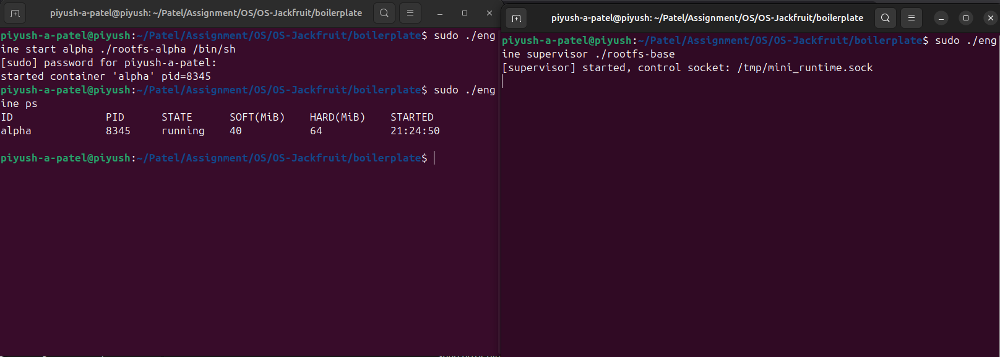
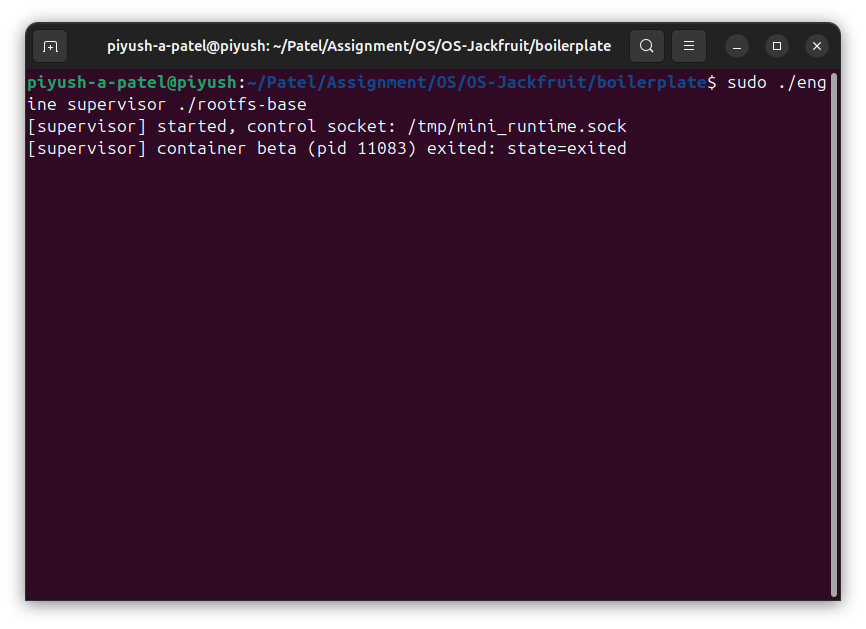
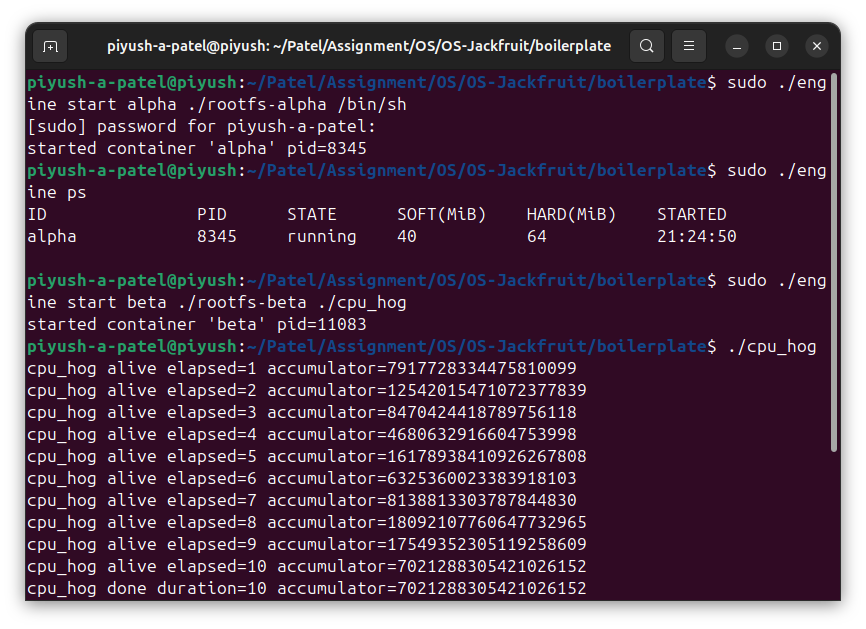
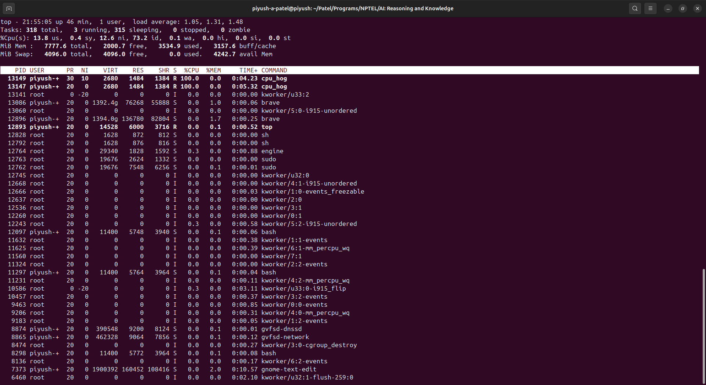
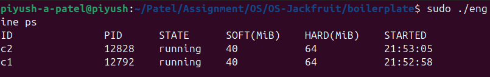
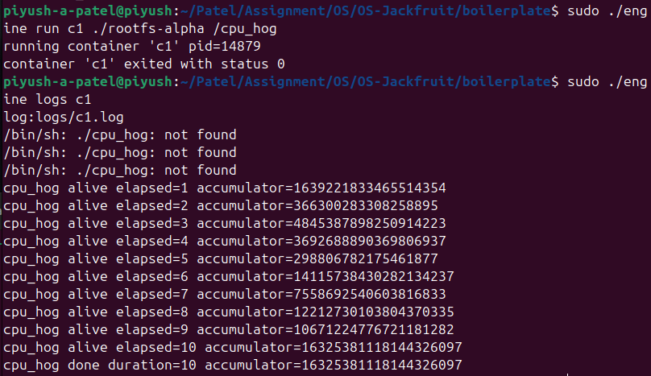
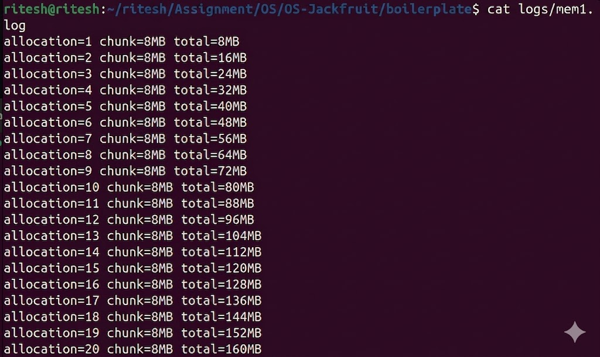
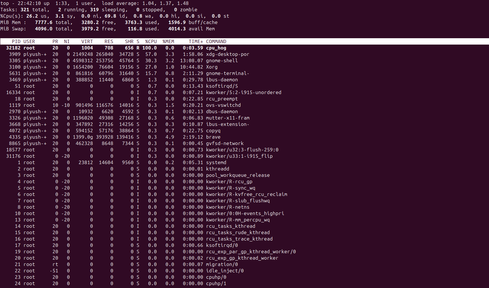
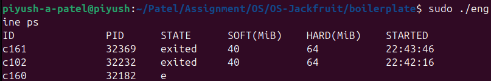
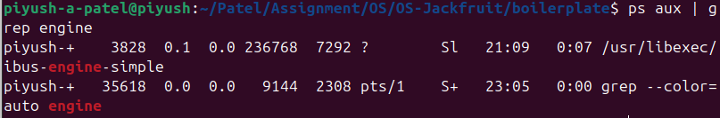

# OS Jackfruit – Mini Container Runtime

## Team Information

- Piyush A Patel (PES2UG24CS350)
- Ritesh P (PES2UG24CS340)

---

## Build, Load, and Run Instructions

### Build
```
make
```

### Load Kernel Module
```
sudo insmod monitor.ko
```

### Verify Device
```
ls -l /dev/container_monitor
```

### Start Supervisor
```
sudo ./engine supervisor ./rootfs-base
```

---

## Container Management

Containers are created using:
```
sudo ./engine start <name> <rootfs> /bin/sh
```

List containers:
```
sudo ./engine ps
```



---

## CPU Scheduling Experiment

Commands:
```
cpu_hog
nice -n 10 cpu_hog
```

Observation:
- Lower nice value gives higher priority
- Higher nice value gives lower priority
- Scheduler prefers lower nice value



---

## Memory Management Experiment

Command:
```
sudo ./engine run mem1 ./rootfs-alpha /memory_hog
```

Observation:
- Memory usage increases continuously
- Reaches around 30–40 percent
- System remains stable



---

## Logging System

Command:
```
sudo ./engine logs c1
```

Observation:
- Logs are stored in files
- Output captured correctly



---

## CPU vs IO Experiment

- cpu_hog is CPU bound
- io_pulse is IO bound

Observation:
- cpu_hog uses high CPU
- io_pulse runs intermittently



---

## Clean Teardown

- Containers stopped successfully
- No leftover processes

Command:
```
ps aux | grep engine
```



---

## Engineering Analysis

- Containers use namespaces for isolation
- Scheduler manages CPU allocation
- Kernel module enforces memory limits
- IPC uses sockets
- Logging uses producer consumer model



---

## Design Decisions and Tradeoffs

- Namespaces provide isolation but increase complexity
- Supervisor simplifies control but adds dependency
- Kernel module provides control but increases risk



---

## Additional Results




---

## Conclusion

The project demonstrates key operating system concepts such as scheduling, memory management, and containerization.
